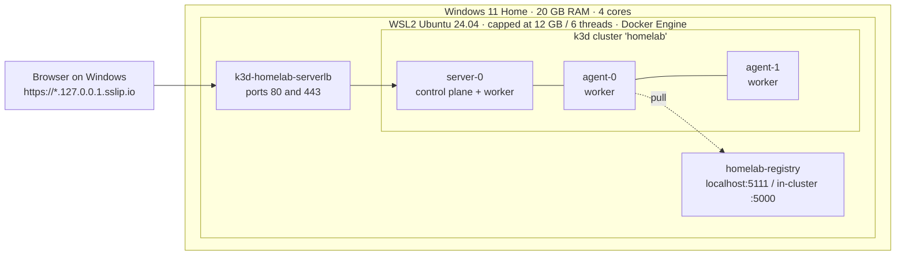
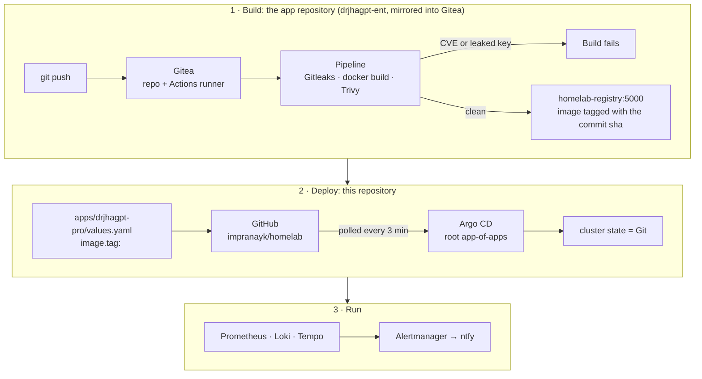
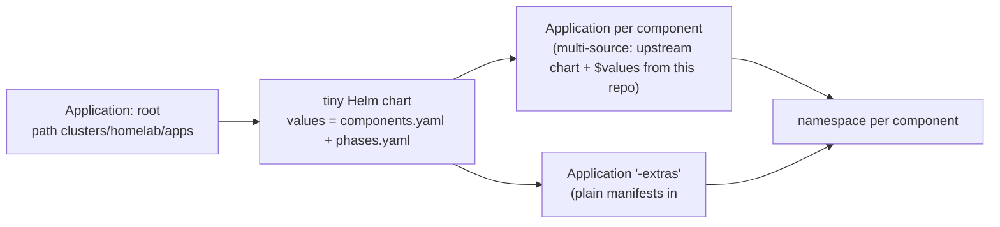

# Architecture

One laptop (Dell Inspiron 14, i5-1155G7, 20 GB RAM, no GPU, Windows 11 Home) running a
production-style Kubernetes platform for a handful of Streamlit AI applications. Every layer is
free and open source. Every change goes through Git.

Blog post with the full layer map and the enterprise equivalents:
https://drpranayjha.com/home-lab-blueprint-ai-kubernetes-one-laptop/

## 1. Physical layout

- WSL2 is a real VM; `.wslconfig` caps it at 12 GB and 6 threads so Windows keeps 8 GB.
- Docker Engine runs natively in Ubuntu (Docker Desktop was dropped: too old for WSL 2.7).
- The three k3s nodes are Docker containers. A tiny load-balancer container maps the laptop's
  ports 80/443 into the cluster; `127.0.0.1.sslip.io` names resolve to the laptop with no DNS setup.
- The k3d registry is where the CI pipeline pushes images and where the nodes pull from.

## 2. What runs where (as of phase 3)

| Namespace | Components | Reached at |
|---|---|---|
| `argocd` | Argo CD (server, repo-server, application controller, applicationset controller, redis) | https://argocd.127.0.0.1.sslip.io |
| `ingress-nginx` | ingress-nginx controller (LoadBalancer via k3d servicelb) | ports 80/443 |
| `cert-manager` | cert-manager, the lab CA (`homelab-ca` ClusterIssuer) | |
| `gitea` | Gitea (SQLite, packages + actions enabled), Actions runner with Docker-in-Docker sidecar | https://gitea.127.0.0.1.sslip.io |
| `monitoring` | Prometheus, Alertmanager, Grafana, kube-state-metrics, node-exporter ×3, Loki (single binary), Alloy ×3, Tempo, OpenTelemetry collector, ntfy, ntfy-alertmanager bridge | https://grafana.127.0.0.1.sslip.io, https://ntfy.127.0.0.1.sslip.io |
| `apps` | drjhagpt-pro (Streamlit), its `drjhagpt-pro-env` Secret | https://drjhagpt.127.0.0.1.sslip.io |
| `kube-system` | k3s: CoreDNS, metrics-server, local-path provisioner, servicelb, flannel | |

Phase 4 (security), 5 (AI platform) and 6 (day 2) namespaces appear when their phase is switched
on in `clusters/homelab/phases.yaml`. See the README for the component list per phase.

## 3. How a change reaches the cluster

- **Nothing is applied by hand after bootstrap.** `bootstrap/10-argocd.sh` installs Argo CD once
  and applies `clusters/homelab/root.yaml`. From then on Argo CD manages itself, too.
- **Renovate** (a Gitea Actions workflow) will open pull requests here when a chart pin in
  `components.yaml` or an image tag is stale. The image-tag bump is still manual as of phase 2.

## 4. How the app-of-apps works

`components.yaml` is the catalogue: one entry per layer with the chart repository, pinned version,
namespace, phase, sync wave, values path, and optional `enabled`, `extras`, `localChart`,
`releaseName`. `phases.yaml` is the switch panel: a phase set to `enabled: false` prunes every
Application in it, which is how the memory budget is managed on a 20 GB laptop.

## 5. Secrets

| Stage | Where the secret lives | How it reaches the pod |
|---|---|---|
| Phases 1-3 (now) | `secrets/<namespace>.<name>.env` on the laptop, gitignored; `bootstrap/21-gen-secrets.sh` generates platform passwords, you add API keys | `bootstrap/20-secrets.sh` creates Kubernetes Secrets; charts reference them by name (`existingSecret`, `secretKeyRef`, `envFromSecret`) |
| Phase 4 (planned) | OpenBao (KV v2) | External Secrets Operator syncs an `ExternalSecret` into the same Secret names, so nothing else changes |

No password or key is committed. The repository is public.

## 6. Networking and TLS

- One ingress controller (ingress-nginx), one wildcard naming scheme (`<service>.127.0.0.1.sslip.io`).
- cert-manager issues every certificate from the lab CA (`platform/phase-1-cluster/cert-manager/extras/ca-issuer.yaml`).
  `bootstrap/30-trust-ca.sh` imports that CA into Windows, so browsers show a valid lock.
- Inside the cluster, services talk by DNS name (`gitea-http.gitea.svc`, `loki-gateway.monitoring.svc`).
  The lab hostnames do not work from inside a pod's Docker-in-Docker (they resolve to 127.0.0.1 there),
  which is why the pipeline pushes to `homelab-registry:5000` and not to Gitea's registry.

## 7. Resource budget (measured)

| State | Memory across the three nodes |
|---|---|
| Phases 1 + 2 at rest | ~4.7 GB (the runner's Docker-in-Docker sidecar is the surprise) |
| Phases 1 + 2 + 3 at rest | ~6.3 GB |
| Phase 4 first attempt, everything at once | laptop hung (CPU saturation during start-up, not memory) |
| WSL cap | 12 GB |

Phases 4, 5 and 6 are meant to be studied with another phase parked. That is the design, not a limitation.

## 8. Known incidents and what they changed

See `docs/RUNBOOK.md` for step-by-step recovery and `docs/BUILD-LOG.md` for the full narrative.

| Date | What happened | What changed in this repo |
|---|---|---|
| 2026-09-19 | Docker Desktop could not start on WSL 2.7 | `bootstrap/00-docker.sh` (native Docker Engine) |
| 2026-09-20 | Pipeline could not push to Gitea's registry from Docker-in-Docker | Pipeline pushes to `homelab-registry:5000`; DinD `--insecure-registry` |
| 2026-09-20 | Every pod log full of kubelet fsnotify errors | inotify sysctls in `bootstrap/01-cluster.sh` |
| 2026-09-20 | Self-managing Argo CD created a duplicate Argo CD | `releaseName: argocd` on the component; `DuplicateArgoCDController` alert |
| 2026-09-20 | Kyverno webhooks blocked the API while its pod was starting | `failurePolicy: Ignore`; phase 4 goes on one component at a time |
| 2026-09-20 | Argo CD repo-server OOM-killed 10× after a reboot | repo-server limit 1 GiB |
